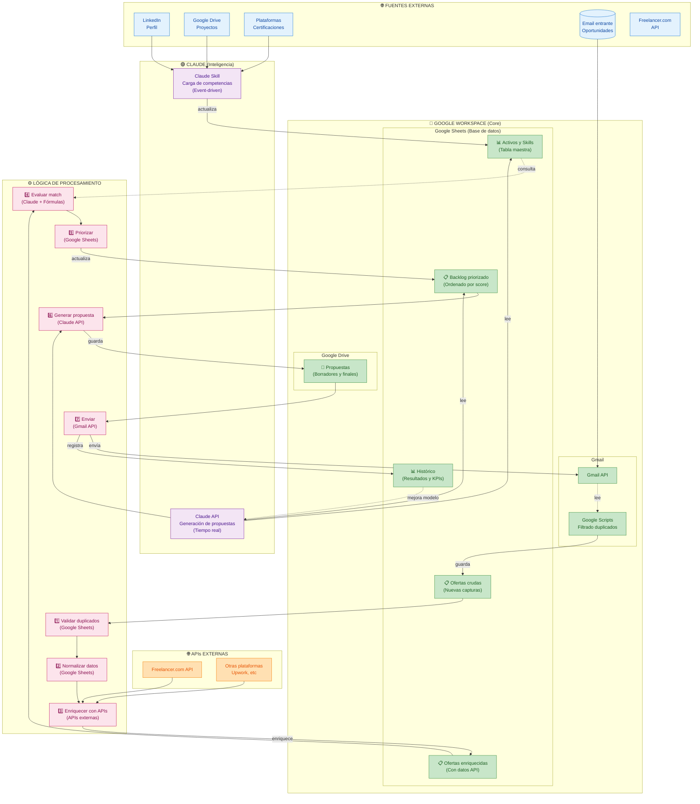

# Vista de Componentes Tecnológicos - Leads Auto

Arquitectura simplificada de integraciones y herramientas.



## Stack Tecnológico - Stack Minimizado

### 🟢 **Google Workspace Business** (Núcleo del sistema)

#### Gmail
- **Gmail API**: Lectura de emails con oportunidades
- **Google Scripts**: Filtrado automático, eliminación de duplicados
- **Capacidad**: Procesamiento en tiempo real

**Ejemplo Script:**
```javascript
// Buscar emails no procesados
// Extraer remitente, empresa, descripción
// Calcular hash para detectar duplicados
// Guardar en Google Sheets
```

#### Google Sheets (Base de datos centralizada)
| Tabla | Propósito | Schema |
|-------|-----------|--------|
| **Activos y Skills** | Inventario de competencias | Skill, Nivel, Proyectos, Certificaciones, LinkedIn URL |
| **Ofertas crudas** | Ofertas sin procesar | Fecha, Remitente, Empresa, Descripción, URL, Hash |
| **Ofertas enriquecidas** | Ofertas con datos API | ... + Presupuesto, Skills requeridas, Plataforma |
| **Backlog priorizado** | Ordenadas por relevancia | Oferta, Skills match, Score (0-100), Prioridad, Estado |
| **Histórico** | Seguimiento de resultados | Propuesta, Resultado, Fecha, Ingresos, Métricas |

**Ventajas:**
- ✅ Acceso desde cualquier lugar
- ✅ Colaboración en tiempo real
- ✅ Fórmulas nativas para cálculos
- ✅ Integración nativa con Apps Script
- ✅ Sin costo adicional (incluido en Workspace)

#### Google Drive
- **Almacenamiento**: Propuestas generadas (PDF, Docs, HTML)
- **Versionado**: Historial de cambios automático
- **Integración**: Exportar propuestas para envío por email

#### Google Apps Script
**Automatizaciones:**
- Lectura de Gmail y extracción de datos
- Filtrado de duplicados (consulta Google Sheets)
- Normalización de datos
- Sincronización de Sheets con APIs externas
- Triggers programados

---

### 🟣 **Claude (Pro + API)**

#### Claude Skill (Carga de Competencias)
**Tipo:** Event-driven, ejecutado manualmente o por cambios  
**Función:** Lectura inteligente de LinkedIn, Drive (proyectos), certificaciones

**Proceso:**
1. Lee perfil LinkedIn (HTML/datos)
2. Extrae skills, experiencia, nivel
3. Lee proyectos desde Google Drive
4. Extrae certificaciones desde plataformas
5. Estructura datos en formato normalizado
6. Guarda en Google Sheets (Activos y Skills)

**Costos:** Incluido en Claude Pro (uso mensual limitado)

#### Claude API (Generación de Propuestas)
**Tipo:** On-demand, llamada en tiempo real  
**Función:** Generar propuestas personalizadas

**Entrada:**
```json
{
  "oportunidad": {
    "empresa": "TechCorp",
    "descripción": "Desarrollar API REST",
    "presupuesto": "$5000-$8000",
    "skills_requeridas": ["Python", "FastAPI", "PostgreSQL"]
  },
  "competencias": {
    "skills": ["Python", "FastAPI", "PostgreSQL", "Django"],
    "proyectos_similares": ["Proyecto A", "Proyecto B"],
    "certificaciones": ["AWS Solutions Architect"]
  },
  "template": "propuesta_desarrollo_api_v1"
}
```

**Salida:** Propuesta personalizada (texto + estructura HTML)

**Costos:** Pay-as-you-go (tokens), aproximadamente $0.50-$2 por propuesta

---

### 🌐 **APIs Externas**

#### Freelancer.com API
**Función:** Enriquecer datos de oportunidades  
**Datos obtenidos:**
- Presupuesto exacto
- Skills requeridas (lista de categorías)
- Complejidad del proyecto
- Descripción extendida
- Timeline estimado

**Llamada:** Solo para ofertas nuevas (no procesadas antes)

#### LinkedIn (Lectura manual/semi-automática)
**Función:** Obtener perfil actualizado  
**Datos:** Experiencia, skills, certificaciones, proyectos

**Método:** Lectura manual o script que descarga HTML

#### Plataformas de Certificaciones
**Función:** Validar certificaciones activas  
**Datos:** Nombre, fecha de validación, URL de verificación

---

## Flujo de Datos - Diagrama Simplificado

```
┌─────────────────────────────────────────────────────────┐
│  ENTRADA: Gmail (Oportunidades)                        │
└─────────────────────────────────────────────────────────┘
                          ↓
┌─────────────────────────────────────────────────────────┐
│  FILTRADO: Google Scripts                              │
│  - Extraer datos esenciales                            │
│  - Validar duplicados (Google Sheets)                  │
│  - Normalizar formato                                  │
└─────────────────────────────────────────────────────────┘
                          ↓
┌─────────────────────────────────────────────────────────┐
│  GUARDADO: Google Sheets (Ofertas crudas)              │
└─────────────────────────────────────────────────────────┘
                          ↓
┌─────────────────────────────────────────────────────────┐
│  ENRIQUECIMIENTO: APIs Externas                        │
│  - Freelancer.com API (solo no procesados)             │
│  - Obtener datos adicionales                           │
└─────────────────────────────────────────────────────────┘
                          ↓
┌─────────────────────────────────────────────────────────┐
│  GUARDADO: Google Sheets (Ofertas enriquecidas)        │
└─────────────────────────────────────────────────────────┘
                          ↓
┌─────────────────────────────────────────────────────────┐
│  EVALUACIÓN: Claude + Fórmulas Sheets                  │
│  - Consultar Activos y Skills (Google Sheets)          │
│  - Calcular match (Claude)                             │
│  - Priorizar (Score 0-100)                             │
└─────────────────────────────────────────────────────────┘
                          ↓
┌─────────────────────────────────────────────────────────┐
│  BACKLOG: Google Sheets (Ordenado por Score)           │
└─────────────────────────────────────────────────────────┘
                          ↓
┌─────────────────────────────────────────────────────────┐
│  GENERACIÓN: Claude API                                │
│  - Generar propuesta personalizada                     │
│  - Guardar en Google Drive                             │
└─────────────────────────────────────────────────────────┘
                          ↓
┌─────────────────────────────────────────────────────────┐
│  ENVÍO: Gmail API                                      │
│  - Enviar propuesta por email                          │
│  - Registrar en Histórico                              │
└─────────────────────────────────────────────────────────┘
                          ↓
┌─────────────────────────────────────────────────────────┐
│  SEGUIMIENTO: Google Sheets (Histórico + KPIs)         │
└─────────────────────────────────────────────────────────┘
```

---

## Matriz de Herramientas vs. Funcionalidad

| Función | Herramienta | Alternativa |
|---------|-----------|-----------|
| **Entrada de datos** | Gmail API | Zapier, Make |
| **Filtrado/Deduplicación** | Google Scripts | Node.js, Python |
| **Base de datos** | Google Sheets | Airtable, Supabase |
| **Enriquecimiento de datos** | APIs nativas + Google Scripts | Zapier, Make |
| **Inteligencia (competencias)** | Claude Skill | OpenAI API, Gemini |
| **Inteligencia (propuestas)** | Claude API | OpenAI API, Gemini |
| **Almacenamiento de propuestas** | Google Drive | AWS S3, Dropbox |
| **Envío de emails** | Gmail API | SendGrid, Mailgun |
| **Dashboard/Reportes** | Google Sheets + Charts | Tableau, Metabase |

---

## Estimación de Costos Mensuales

| Servicio | Costo | Notas |
|---------|------|-------|
| Google Workspace Business | $18/mes | Incluye Gmail, Sheets, Drive, Apps Script |
| Claude Pro | $20/mes | Uso limitado (incluido) |
| Claude API (On-demand) | ~$20-50/mes | Depende de volumen de propuestas |
| APIs externas (Freelancer, etc) | $0/mes | Muchas son gratuitas o incluidas |
| **Total** | **~$58-88/mes** | Stack muy eficiente |

---

## Ventajas del Stack Elegido

✅ **Mínimas herramientas**: Solo Google Workspace + Claude  
✅ **Bajo costo**: ~$60-90/mes  
✅ **Sin servidores**: Todo basado en APIs de terceros  
✅ **Escalable**: Fácil aumentar volumen  
✅ **Integración nativa**: Google Sheets ↔ Apps Script  
✅ **Colaboración**: Sheets permite múltiples usuarios  
✅ **Auditoría**: Historial automático en Google Sheets  
✅ **Mantenimiento mínimo**: No hay infraestructura propia  

---

## Próximos Pasos de Implementación

1. **[ ] Sistema 1 - Competencias**
   - Crear Skill de Claude para leer LinkedIn + proyectos
   - Estructurar Google Sheets (Activos y Skills)
   - Configurar trigger para cambios

2. **[ ] Sistema 2 - Captura de Ofertas**
   - Crear Google Script para filtrado en Gmail
   - Schema en Google Sheets (Ofertas crudas)
   - Implementar APIs de plataformas externas

3. **[ ] Sistema 3 - Propuestas**
   - Integrar Claude API para generación
   - Schema en Google Sheets (Backlog)
   - Configurar envío via Gmail API

4. **[ ] Monitoreo y KPIs**
   - Dashboard en Google Sheets
   - Métricas de conversión y ROI
