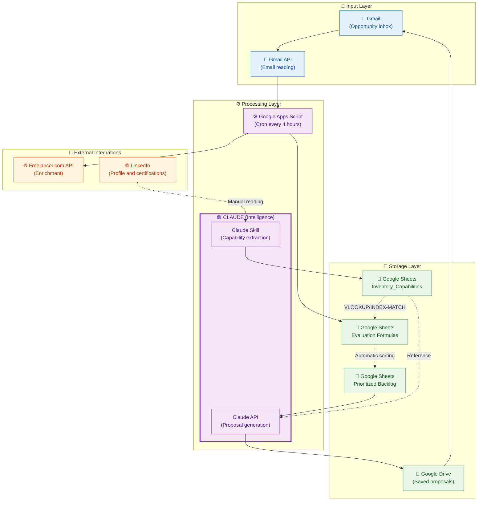
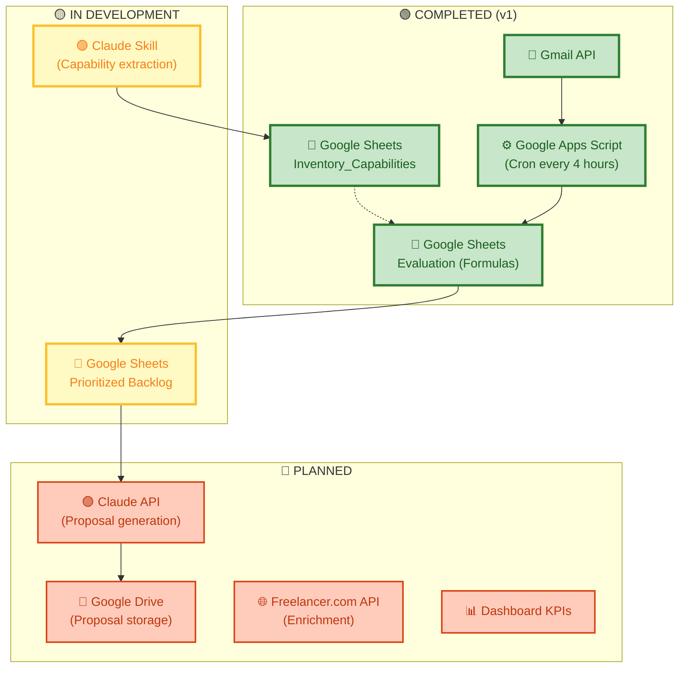
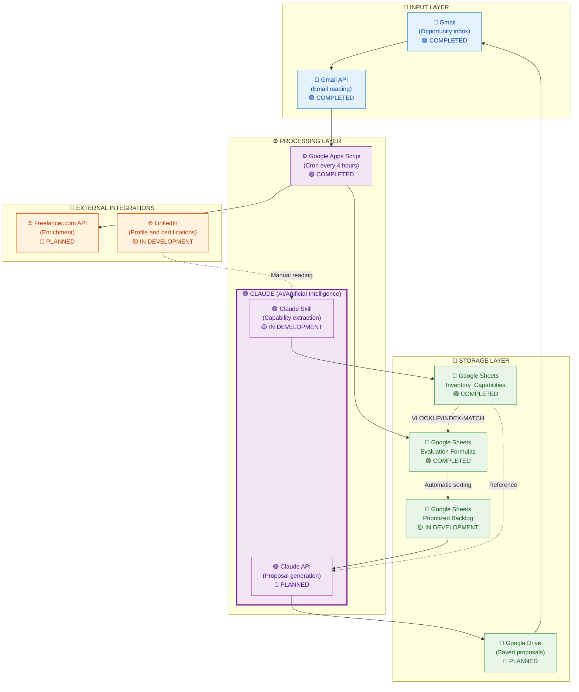
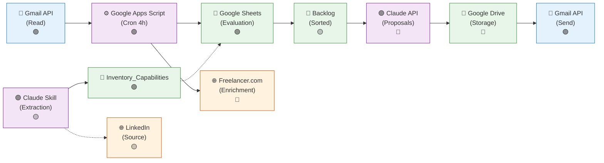

# Technology Components View - Leads Auto

Detailed description of technological components, integrations, and system data flows.

---

## 📋 Legend of States and Styles

### Component States

```
🟢 COMPLETED (v1)       → Component implemented and functional
🟡 IN DEVELOPMENT       → Component initiated but not finished
🔴 PLANNED              → Component designed but not started
```

### Meaning of Colors in Graphs

| Color | Type | Meaning |
|-------|------|---------|
| 🔵 **Blue** (`#e3f2fd`) | Gmail and input APIs | System entry point, reading external data |
| 🟣 **Purple** (`#f3e5f5`) | Processing/Claude | Intelligent logic, transformation, content generation |
| 🟢 **Green** (`#e8f5e9`) | Storage | Databases, Google Sheets, data persistence |
| 🟠 **Orange** (`#fff3e0`) | External Integrations | External APIs, third-party data sources |

### Types of Lines in Graphs

| Line | Type | Meaning |
|------|------|---------|
| `→` **Solid line** | Direct main flow | Data flows directly from component to component |
| `-.->` **Dotted line** | Reference flow | Query/read without modifying data (VLOOKUP, references) |
| **Normal thickness** | Standard process | Regular system operation |
| **Triple thickness** | Critical process | Important operation, trigger, decision point |
| **Dashed line** | Conditional connection | Happens under certain conditions |

### Legend of Symbols in Nodes

| Symbol | Meaning |
|--------|---------|
| 📧 | Gmail, Email, communication |
| ⚙️ | Processing, Scripts, automation |
| 💾 | Storage, database |
| 🔗 | External connection, API, integration |
| 🟢/🟡/🔴 | State: Completed / In development / Planned |

---

## Architecture of Components (By Layers)



---

## Components with Implementation States



---

## Architecture of Components (By Layers) - Detailed with Icons



---

## Summary: Integrations and Complete Flow



### 📌 Legend of the Final Graph

**Color dots on the right:**
- 🟢 = Component already completed (implemented and functional)
- 🟡 = Component in development (partially implemented)
- 🔴 = Component planned (designed but not started)

**Background colors (nodes):**
- 🔵 Blue = Gmail/Email components
- 🟣 Purple = Claude/AI components
- 🟢 Green = Storage (Sheets, Drive)
- 🟠 Orange = External integrations (APIs)

**Types of lines:**
- `→` Main flow (data transforms/processes)
- `-.->` Reference flow (read without modification)

---

## Detailed Components

### 1. 🔵 Gmail and Gmail API | 🟢 COMPLETED
**Function:** System entry point, reading opportunities.

| Property | Description |
|----------|------------|
| **Status** | 🟢 Completed (v1) |
| **Type** | Email service + API |
| **Role** | Receive opportunities, send proposals |
| **Trigger** | New email in specific inbox |
| **Read Frequency** | Every 4 hours (via Google Apps Script Cron) |
| **Input Data** | Raw email (sender, subject, body, attachments) |
| **Authentication** | OAuth 2.0 |

**Extracted Fields:**
```
From: sender@company.com
Subject: Project Opportunity
Body: Description, requirements, budget (optional)
```

---

### 2. ⚙️ Google Apps Script (Cron - Every 4 hours) | 🟢 COMPLETED
**Function:** Automatic email processing at regular intervals.

| Property | Description |
|----------|------------|
| **Status** | 🟢 Completed (v1) |
| **Type** | Serverless automation |
| **Role** | Processing orchestration, extraction, validation, enrichment |
| **Trigger** | Cron every 4 hours |
| **Location** | Google Drive (associated script) |
| **Dependencies** | Gmail API, Sheets API, external APIs |

**Responsibilities:**
```
1. Read unprocessed emails
2. Extract: sender, company, description, URL, budget
3. Generate hash for duplicate detection
4. Query Google Sheets: Already processed?
5. If duplicate: mark and discard
6. If new: normalize data
7. Enrich from Freelancer.com API (if necessary)
8. Save processed data in "Evaluation" sheet
9. Allow Sheets formulas to do matching and scoring
```

**Pseudocode:**
```javascript
function processEmailsCron() {
  // Executed every 4 hours
  const unprocessedEmails = getUnprocessedEmails();
  
  unprocessedEmails.forEach(email => {
    const extracted = extractData(email);
    const hash = generateHash(extracted);
    
    if (isProcessedBefore(hash)) {
      markAsDuplicate(hash);
      return;
    }
    
    const normalized = normalizeData(extracted);
    const enriched = enrichFromFreelancer(normalized);
    
    saveToEvaluationSheet(enriched);
  });
}
```

---

### 3. 💾 Google Sheets: Inventory_Capabilities | 🟢 COMPLETED
**Function:** Store updated inventory of skills, certifications, and projects.

| Property | Description |
|----------|------------|
| **Status** | 🟢 Completed (v1) |
| **Type** | Spreadsheet (Google Sheets) |
| **Role** | Single source of truth for capabilities |
| **Update** | Event-driven (via Claude Skill) |
| **Access** | VLOOKUP/INDEX-MATCH from Evaluation |

**Schema:**
```
| Skill | Level | Type | Projects | Certifications | LinkedIn URL | Last updated |
|-------|-------|------|----------|-----------------|--------------|--------------|
| Python | Advanced | Language | [links] | [certs] | https://... | 2026-08-24 |
| React | Intermediate | Framework | [links] | - | https://... | 2026-08-20 |
| ...
```

**Allowed Levels:** Basic, Intermediate, Advanced, Expert

---

### 4. 💾 Google Sheets: Evaluation (Formulas) | 🟢 COMPLETED
**Function:** Process offers with formulas, calculate match and scoring automatically.

| Property | Description |
|----------|------------|
| **Status** | 🟢 Completed (v1) |
| **Type** | Spreadsheet with formulas (Google Sheets) |
| **Role** | Automatic evaluation, matching and scoring |
| **Update** | Automatic (data from Google Apps Script + formulas) |
| **Reference** | Inventory_Capabilities |

**Schema with Formulas:**
```
| Date | Sender | Company | Description | Budget | Required Skills | 
| Available Skills* | Match %** | Score*** | Priority | Status | Assigned |

*VLOOKUP formula: =VLOOKUP(A2, Inventory_Capabilities!A:Z, 2, FALSE)
**Matching formula: percentage of available vs required skills
***Score: prioritization algorithm (match + budget + complexity)
```

**Key Formulas:**

**Match Score:**
```
= COUNTIF(AvailableSkills, RequiredSkills) / LEN(RequiredSkills) * 100
```

**Final Score:**
```
= (MatchScore * 0.5) + (NormalizedBudget * 0.3) + (Complexity * 0.2)
```

**Automatic Sorting:** The sheet automatically sorts by descending Score.

---

### 5. 💾 Google Sheets: Prioritized Backlog | 🟡 IN DEVELOPMENT
**Function:** Sorted view of opportunities ready for proposal.

| Property | Description |
|----------|------------|
| **Status** | 🟡 In development |
| **Type** | Sorted sheet (filtered from Evaluation) |
| **Role** | Source for System 3 (Proposals) |
| **Update** | Automatic (based on Evaluation) |
| **Order** | Descending Score (best match first) |

---

### 6. 🟣 Claude Skill (Capability Loading) | 🟡 IN DEVELOPMENT
**Function:** Intelligent extraction of data from LinkedIn and projects.

| Property | Description |
|----------|------------|
| **Status** | 🟡 In development |
| **Type** | Claude AI (Mode: Skill) |
| **Role** | Event-driven capability extraction |
| **Trigger** | Manual or detected changes |
| **Input** | LinkedIn profile, Drive documents |
| **Output** | Structured data for Inventory_Capabilities |

**Process:**
```
1. Read LinkedIn profile (manually or via web scraping)
2. Extract: skills, level, experience
3. Read certifications and validations
4. Read projects from Google Drive
5. Structure in standard format
6. Save to Inventory_Capabilities
```

---

### 7. 🟣 Claude API (Proposal Generation) | 🔴 PLANNED
**Function:** Automatic generation of personalized proposals.

| Property | Description |
|----------|------------|
| **Status** | 🔴 Planned |
| **Type** | Claude API (model: claude-opus/sonnet) |
| **Role** | Intelligent proposal generation |
| **Trigger** | Manual (user selects opportunity from backlog) |
| **Input** | Offer data + Inventory_Capabilities |
| **Output** | Proposal in text/Markdown format |

**Typical Input:**
```json
{
  "offer": {
    "company": "TechCorp",
    "description": "Develop React application",
    "budget": "$5000-$8000",
    "required_skills": ["React", "Node.js", "PostgreSQL"],
    "deadline": "2026-09-30"
  },
  "competencies": {
    "available_skills": ["React", "Node.js", "MongoDB", "Python"],
    "level": ["Advanced", "Advanced", "Intermediate", "Advanced"],
    "similar_projects": [
      "E-commerce with React and Node.js (2025)",
      "React Dashboard (2025)"
    ],
    "certifications": ["AWS Solutions Architect", "React Advanced"]
  },
  "template": "standard_proposal_v1"
}
```

**System Prompt:**
```
You are a specialist in technical proposal writing. 
Based on the offer and available competencies, 
generate a professional, personalized, and convincing proposal 
that highlights the alignment between skills and requirements.
```

---

### 8. 📄 Google Drive | 🔴 PLANNED
**Function:** Storage of generated proposals and documents.

| Property | Description |
|----------|------------|
| **Status** | 🔴 Planned |
| **Type** | Cloud storage service |
| **Role** | Save proposals, projects, certifications |
| **Structure** | Folders organized by year/client |

**Recommended Structure:**
```
Leads-Auto/
├── Proposals/
│   ├── 2026/
│   │   ├── Client-Date-Proposal.pdf
│   │   └── ...
├── Projects/
│   ├── Project1-Description.md
│   └── ...
└── Certifications/
    └── Cert-*.pdf
```

---

### 9. 🌐 Freelancer.com API | 🔴 PLANNED
**Function:** Offer data enrichment.

| Property | Description |
|----------|------------|
| **Status** | 🔴 Planned |
| **Type** | External REST API |
| **Role** | Get additional information about opportunities |
| **Location** | Called from Google Apps Script |
| **Authentication** | API Key |

**Data Obtained:**
```
- Typical budget for skill
- Estimated complexity
- Market trends
- Suggested additional skills
```

---

### 10. 🌐 LinkedIn | 🟡 IN DEVELOPMENT
**Function:** Data source for capabilities.

| Property | Description |
|----------|------------|
| **Status** | 🟡 In development |
| **Type** | Professional social network |
| **Role** | Read profile, skills, certifications |
| **Integration** | Manual or web scraping (if allowed) |

---

## Main Data Flows

### Flow 1: Capability Update (Event-driven) | 🟡 IN DEVELOPMENT
```
LinkedIn/Drive → 🟣 Claude Skill → 💾 Inventory_Capabilities → (reference in Evaluation)
```

**Frequency:** Manual / Detected changes

---

### Flow 2: Offer Processing (Every 4 hours) | 🟢 COMPLETED
```
📧 Gmail → 🔵 Gmail API → ⚙️ Google Apps Script (Cron)
  ├─ Extract data
  ├─ Validate (Duplicate?)
  ├─ Normalize
  ├─ Enrich (Freelancer.com API)
  └─ Save to Evaluation

💾 Evaluation (automatic formulas)
  ├─ Retrieve skills from Inventory_Capabilities
  ├─ Calculate match
  ├─ Calculate score
  └─ Automatically sort → 💾 Prioritized Backlog
```

**Frequency:** Every 4 hours

---

### Flow 3: Proposal Generation (Manual) | 🔴 PLANNED
```
User selects in 💾 Prioritized Backlog
  ��� 🟣 Claude API (input: offer + Inventory_Capabilities)
  → Generate proposal
  → Review/adjust (manual)
  → Save to 📄 Google Drive
  → Send via 🔵 Gmail API
```

**Frequency:** On demand

---

### Flow 4: Tracking and Results | 🔴 PLANNED
```
Proposal sent → Record in 💾 Google Sheets
  → Calculate KPIs (conversion rate, revenue, etc)
  → Display in Dashboard
```

**Frequency:** Automatic

---

## Technology Matrix

| Component | Technology | Purpose | Frequency | Status |
|-----------|-----------|---------|-----------|--------|
| Email input | 🔵 Gmail API | Receive opportunities | Cron every 4h | 🟢 Completed |
| Automatic processing | ⚙️ Google Apps Script | Extract, validate, enrich | Every 4 hours | 🟢 Completed |
| Capability storage | 💾 Google Sheets | Unique skills inventory | Event-driven | 🟢 Completed |
| Offer evaluation | 💾 Google Sheets (formulas) | Automatic matching | Real-time | 🟢 Completed |
| Prioritized backlog | 💾 Google Sheets (sorted) | Opportunity view | Automatic | 🟡 In development |
| Data enrichment | 🌐 Freelancer.com API | Additional data | Every 4 hours | 🔴 Planned |
| Capability extraction | 🟣 Claude Skill | Intelligent reading | Event-driven | 🟡 In development |
| Proposal generation | 🟣 Claude API | Intelligent writing | Manual (on demand) | 🔴 Planned |
| Proposal storage | 📄 Google Drive | Final documents | Manual | 🔴 Planned |
| Proposal sending | 🔵 Gmail API | Client communication | Manual | 🟢 Completed |

---

## Implementation Considerations

### Performance
- **Cron every 4 hours:** Avoids overload, processes in batch
- **Formulas in Sheets:** Faster than API calls for simple operations
- **Data caching:** Minimize calls to external APIs
- **Indexes:** Use hash for quick duplicate detection

### Security
- **Authentication:** OAuth 2.0 for Gmail, secure API Keys
- **Sensitive data:** Don't store credentials in scripts
- **Validation:** Sanitize data before sending to APIs

### Scalability
- **Sheets:** Upgrade to AppSheet or more robust solution if grows
- **Cron:** Consider Cloud Tasks/Pub-Sub for more complex processes
- **Cache:** Implement Redis if data volume grows

---

## Summary: Guide to Reading Graphs

### How to read the diagrams?

1. **Background colors:**
   - 🔵 Blue = Email/reading APIs
   - 🟣 Purple = Processing and AI
   - 🟢 Green = Storage
   - 🟠 Orange = External integrations

2. **Types of lines:**
   - Solid line (`→`) = Main flow (data transformation)
   - Dotted line (`-.->`) = Reference (read-only)

3. **Component status:**
   - 🟢 Green = Completed
   - 🟡 Yellow = In development
   - 🔴 Red = Planned

4. **Component groups:**
   - **Claude** components are grouped under the label **🟣 CLAUDE (AI/Artificial Intelligence)**
   - Each layer has a distinctive symbol (📧 Input, ⚙️ Processing, 💾 Storage, 🔗 External)

---

