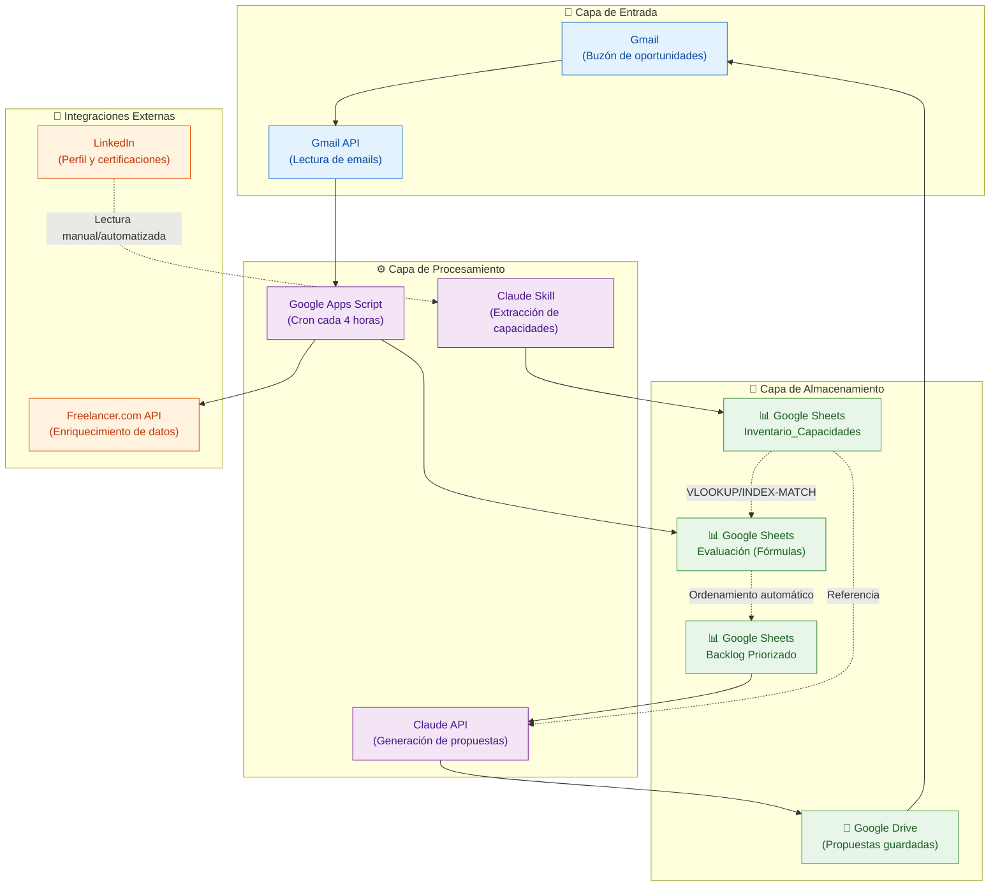
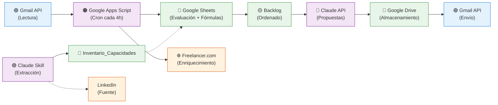

# Vista de Componentes Tecnológicos - Leads Auto

Descripción detallada de los componentes tecnológicos, integraciones y flujos de datos del sistema.

## Arquitectura de Componentes



---

## Componentes Detallados

### 1. 📧 Gmail y Gmail API
**Función:** Punto de entrada del sistema, lectura de oportunidades.

| Propiedad | Descripción |
|-----------|------------|
| **Tipo** | Servicio de email + API |
| **Rol** | Recibir oportunidades, enviar propuestas |
| **Trigger** | Nuevo email en buzón específico |
| **Frecuencia de lectura** | Cada 4 horas (via Google Apps Script Cron) |
| **Datos de entrada** | Email raw (remitente, asunto, cuerpo, adjuntos) |
| **Autenticación** | OAuth 2.0 |

**Campos extraídos:**
```
From: remitente@empresa.com
Subject: Oportunidad de proyecto
Body: Descripción, requirements, presupuesto (opcional)
```

---

### 2. ⚙️ Google Apps Script (Cron - Cada 4 horas)
**Función:** Procesamiento automático de emails en intervalos regulares.

| Propiedad | Descripción |
|-----------|------------|
| **Tipo** | Automatización serverless |
| **Rol** | Orquestación de procesamiento, extracción, validación, enriquecimiento |
| **Trigger** | Cron cada 4 horas |
| **Ubicación** | Google Drive (associated script) |
| **Dependencias** | Gmail API, Sheets API, APIs externas |

**Responsabilidades:**
```
1. Leer emails no procesados
2. Extraer: remitente, empresa, descripción, URL, presupuesto
3. Generar hash para detección de duplicados
4. Consultar Google Sheets: ¿Ya procesado?
5. Si es duplicado: marcar y descartar
6. Si es nuevo: normalizar datos
7. Enriquecer desde Freelancer.com API (si necesario)
8. Guardar datos procesados en hoja "Evaluación"
9. Permitir que fórmulas de Sheets hagan el matching y scoring
```

**Pseudocódigo:**
```javascript
function processEmailsCron() {
  // Ejecutado cada 4 horas
  const unprocessedEmails = getUnprocessedEmails();
  
  unprocessedEmails.forEach(email => {
    const extracted = extractData(email);
    const hash = generateHash(extracted);
    
    if (isProcessedBefore(hash)) {
      markAsDuplicate(hash);
      return;
    }
    
    const normalized = normalizeData(extracted);
    const enriched = enrichFromFreelancer(normalized);
    
    saveToEvaluationSheet(enriched);
  });
}
```

---

### 3. 💾 Google Sheets: Inventario_Capacidades
**Función:** Almacenar el inventario actualizado de skills, certifications y proyectos.

| Propiedad | Descripción |
|-----------|------------|
| **Tipo** | Hoja de cálculo (Google Sheets) |
| **Rol** | Fuente única de verdad para capacidades |
| **Actualización** | Event-driven (via Claude Skill) |
| **Acceso** | VLOOKUP/INDEX-MATCH desde Evaluación |

**Schema:**
```
| Skill | Nivel | Tipo | Proyectos | Certificaciones | LinkedIn URL | Última actualización |
|-------|-------|------|-----------|-----------------|--------------|---------------------|
| Python | Avanzado | Lenguaje | [links] | [certs] | https://... | 2026-08-24 |
| React | Intermedio | Framework | [links] | - | https://... | 2026-08-20 |
| ...
```

**Niveles permitidos:** Básico, Intermedio, Avanzado, Experto

---

### 4. 💾 Google Sheets: Evaluación (Fórmulas)
**Función:** Procesar ofertas con fórmulas, calcular match y scoring automáticamente.

| Propiedad | Descripción |
|-----------|------------|
| **Tipo** | Hoja de cálculo con fórmulas (Google Sheets) |
| **Rol** | Evaluación automática, matching y scoring |
| **Actualización** | Automática (datos de Google Apps Script + fórmulas) |
| **Referencia** | Inventario_Capacidades |

**Schema con Fórmulas:**
```
| Fecha | Remitente | Empresa | Descripción | Presupuesto | Skills requeridas | 
| Skills disponibles* | Match %** | Score*** | Prioridad | Estado | Asignado |

*VLOOKUP formula: =VLOOKUP(A2, Inventario_Capacidades!A:Z, 2, FALSE)
**Fórmula de matching: porcentaje de skills disponibles vs requeridas
***Score: algoritmo de priorización (match + presupuesto + complejidad)
```

**Fórmulas Clave:**

**Match Score:**
```
= COUNTIF(SkillsDisponibles, SkillsRequeridas) / LEN(SkillsRequeridas) * 100
```

**Score Final:**
```
= (MatchScore * 0.5) + (NormalizePresupuesto * 0.3) + (Complejidad * 0.2)
```

**Ordenamiento automático:** La hoja se ordena automáticamente por Score descendente.

---

### 5. 💾 Google Sheets: Backlog Priorizado
**Función:** Vista ordenada de oportunidades listas para propuesta.

| Propiedad | Descripción |
|-----------|------------|
| **Tipo** | Hoja ordenada (filtrada de Evaluación) |
| **Rol** | Fuente para Sistema 3 (Propuestas) |
| **Actualización** | Automática (basada en Evaluación) |
| **Orden** | Score descendente (mejor match arriba) |

---

### 6. ⚙️ Claude Skill (Carga de Capacidades)
**Función:** Extracción inteligente de datos de LinkedIn y proyectos.

| Propiedad | Descripción |
|-----------|------------|
| **Tipo** | Claude AI (Mode: Skill) |
| **Rol** | Extracción event-driven de capacidades |
| **Trigger** | Manual o cambios detectados |
| **Entrada** | Perfil LinkedIn, documentos de Drive |
| **Salida** | Datos estructurados para Inventario_Capacidades |

**Proceso:**
```
1. Leer perfil LinkedIn (manualmente o via web scraping)
2. Extraer: skills, nivel, experiencia
3. Leer certificaciones y validaciones
4. Leer proyectos de Google Drive
5. Estructurar en formato estándar
6. Guardar en Inventario_Capacidades
```

---

### 7. ⚙️ Claude API (Generación de Propuestas)
**Función:** Generación automática de propuestas personalizadas.

| Propiedad | Descripción |
|-----------|------------|
| **Tipo** | Claude API (modelo: claude-opus/sonnet) |
| **Rol** | Generación inteligente de propuestas |
| **Trigger** | Manual (usuario selecciona oportunidad del backlog) |
| **Entrada** | Datos de la oferta + Inventario_Capacidades |
| **Salida** | Propuesta en formato texto/Markdown |

**Entrada típica:**
```json
{
  "oferta": {
    "empresa": "TechCorp",
    "descripcion": "Desarrollar aplicación React",
    "presupuesto": "$5000-$8000",
    "skills_requeridas": ["React", "Node.js", "PostgreSQL"],
    "deadline": "2026-09-30"
  },
  "competencias": {
    "skills_disponibles": ["React", "Node.js", "MongoDB", "Python"],
    "nivel": ["Avanzado", "Avanzado", "Intermedio", "Avanzado"],
    "proyectos_similares": [
      "E-commerce con React y Node.js (2025)",
      "Dashboard con React (2025)"
    ],
    "certificaciones": ["AWS Developer", "React Advanced"]
  },
  "template": "propuesta_estándar_v1"
}
```

**Prompt del sistema:**
```
Eres un especialista en redacción de propuestas técnicas. 
Basándote en la oferta y las competencias disponibles, 
genera una propuesta profesional, personalizada y convincente 
que destaque la alineación entre skills y requisitos.
```

---

### 8. 📄 Google Drive
**Función:** Almacenamiento de propuestas generadas y documentos.

| Propiedad | Descripción |
|-----------|------------|
| **Tipo** | Servicio de almacenamiento en la nube |
| **Rol** | Guardar propuestas, proyectos, certificaciones |
| **Estructura** | Carpetas organizadas por año/cliente |

**Estructura recomendada:**
```
Leads-Auto/
├── Propuestas/
│   ├── 2026/
│   │   ├── Cliente-Fecha-Propuesta.pdf
│   │   └── ...
├── Proyectos/
│   ├── Proyecto1-Descripción.md
│   └── ...
└── Certificaciones/
    └── Cert-*.pdf
```

---

### 9. 🔗 Freelancer.com API
**Función:** Enriquecimiento de datos de ofertas.

| Propiedad | Descripción |
|-----------|------------|
| **Tipo** | API REST externa |
| **Rol** | Obtener información adicional sobre oportunidades |
| **Ubicación** | Llamada desde Google Apps Script |
| **Autenticación** | API Key |

**Datos obtenidos:**
```
- Presupuesto típico para skill
- Complejidad estimada
- Tendencias de mercado
- Skills adicionales sugeridas
```

---

### 10. 🔗 LinkedIn
**Función:** Fuente de datos para capacidades.

| Propiedad | Descripción |
|-----------|------------|
| **Tipo** | Red social profesional |
| **Rol** | Leer perfil, skills, certificaciones |
| **Integración** | Manual o web scraping (si es permitido) |

---

## Flujos de Datos Principales

### Flujo 1: Actualización de Capacidades (Event-driven)
```
LinkedIn/Drive → Claude Skill → Inventario_Capacidades → (referencia en Evaluación)
```

**Frecuencia:** Manual / Cambios detectados

---

### Flujo 2: Procesamiento de Ofertas (Cada 4 horas)
```
Gmail → Gmail API → Google Apps Script (Cron)
  ├─ Extraer datos
  ├─ Validar (¿duplicado?)
  ├─ Normalizar
  ├─ Enriquecer (Freelancer.com API)
  └─ Guardar en Evaluación

Evaluación (fórmulas automáticas)
  ├─ Recuperar skills de Inventario_Capacidades
  ├─ Calcular match
  ├─ Calcular score
  └─ Ordenar automáticamente → Backlog Priorizado
```

**Frecuencia:** Cada 4 horas

---

### Flujo 3: Generación de Propuestas (Manual)
```
Usuario selecciona en Backlog Priorizado
  → Claude API (input: oferta + Inventario_Capacidades)
  → Generar propuesta
  → Revisar/ajustar (manual)
  → Guardar en Google Drive
  → Enviar vía Gmail
```

**Frecuencia:** A demanda

---

### Flujo 4: Seguimiento y Resultados
```
Propuesta enviada → Registrar en Google Sheets
  → Calcular KPIs (tasa conversión, ingresos, etc)
  → Mostrar en Dashboard
```

**Frecuencia:** Automática

---

## Matriz de Tecnologías

| Componente | Tecnología | Propósito | Frecuencia |
|-----------|-----------|----------|-----------|
| Entrada de emails | Gmail API | Recibir oportunidades | Cron cada 4h |
| Procesamiento automático | Google Apps Script | Extraer, validar, enriquecer | Cada 4 horas |
| Almacenamiento capacidades | Google Sheets | Inventario único de skills | Event-driven |
| Evaluación ofertas | Google Sheets (fórmulas) | Matching automático | En tiempo real |
| Backlog priorizado | Google Sheets (ordenado) | Vista de oportunidades | Automático |
| Enriquecimiento datos | Freelancer.com API | Datos adicionales | Cada 4 horas |
| Generación propuestas | Claude API | Redacción inteligente | Manual (a demanda) |
| Almacenamiento propuestas | Google Drive | Documentos finales | Manual |
| Envío propuestas | Gmail API | Comunicación con clientes | Manual |

---

## Consideraciones de Implementación

### Performance
- **Cron cada 4 horas:** Evita sobrecarga, procesa de forma batch
- **Fórmulas en Sheets:** Más rápidas que API calls para operaciones simples
- **Caché de datos:** Minimizar llamadas a APIs externas
- **Índices:** Usar hash para detección rápida de duplicados

### Seguridad
- **Autenticación:** OAuth 2.0 para Gmail, API Keys seguros
- **Datos sensibles:** No guardar credenciales en scripts
- **Validación:** Sanitizar datos antes de enviar a APIs

### Escalabilidad
- **Sheets:** Actualizar a AppSheet o solución más robusta si crece
- **Cron:** Considerar Cloud Tasks/Pub-Sub para procesos más complejos
- **Caché:** Implementar Redis si volume de datos crece

---

## Resumen de Integraciones


