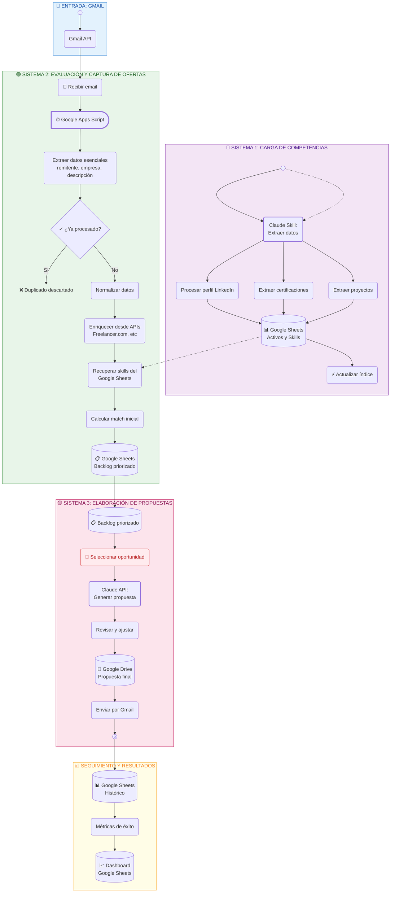

# Vista de Procesos y Pasos - Leads Auto

Diagrama detallado de los procesos, actividades, decisiones y pasos del sistema.



## Descripción Detallada de Procesos

### 📧 Entrada: Gmail
**Trigger:** Nuevo email en buzón específico

---

### 🔵 Sistema 1: Carga de Competencias
**Tipo:** Event-driven (solo cuando hay cambios)  
**Frecuencia:** Manual/automático en cambios  
**Responsabilidad:** Mantener inventario actualizado de skills

| Paso | Herramienta | Descripción |
|------|-------------|------------|
| 1.0 | 🔄 Evento | Cambio detectado en LinkedIn/Proyectos/Certificaciones |
| 1.1 | 🟣 Claude Skill | Leer datos de origen (LinkedIn, Drive con proyectos) |
| 1.2 | 🟣 Claude Skill | Extraer y estructurar perfil LinkedIn |
| 1.3 | 🟣 Claude Skill | Extraer certificaciones y validaciones |
| 1.4 | 🟣 Claude Skill | Extraer proyectos y casos de éxito |
| 1.5 | 💾 Google Sheets | Guardar activos, skills y competencias |
| 1.6 | ⚡ Automático | Actualizar índices y referencias cruzadas |

**Output:** Google Sheets con schema:
```
Skill | Nivel | Proyectos | Certificaciones | LinkedIn URL | Última actualización
```

---

### 🟢 Sistema 2: Evaluación y Captura de Ofertas
**Tipo:** Automático  
**Frecuencia:** Tiempo real (cada email)  
**Responsabilidad:** Procesar, enriquecer y evaluar ofertas para priorización

#### 2.1 - Procesamiento en Google Apps Script (Drive)
El Google Apps Script ejecuta **todo el procesamiento de forma integrada y completa** antes de guardar en Google Sheets. Ningún dato intermedio llega a la hoja.

| Paso | Herramienta | Descripción |
|------|-------------|------------|
| 2.1 | 📧 Gmail | Recibir nuevo email con oportunidad |
| 2.2 | 📝 Google Apps Script | Ejecutar script de procesamiento completo |
| 2.3 | ⚡ Automático | Extraer: remitente, empresa, descripción, URL |
| 2.4 | ✓ Validación | Consultar Google Sheets: ¿Hash ya procesado? |
| 2.4a | ❌ Si duplicado | Marcar como duplicado, no procesar |
| 2.4b | ✅ Si nuevo | Continuar al paso 2.5 |
| 2.5 | ⚡ Automático | Normalizar datos extraídos |
| 2.6 | 🌐 API externa | Enriquecer desde Freelancer.com API (solo no procesados antes) |
| 2.6a | ⚡ Automático | Obtener datos adicionales: presupuesto, skills requeridas, complejidad, etc |

**Datos enriquecidos obtenidos:**
```
Fecha | Remitente | Empresa | Descripción | URL | Hash | Estado
+ Presupuesto | Skills requeridas | Complejidad | Plataforma
```

#### 2.2 - Evaluación y Priorización
| Paso | Herramienta | Descripción |
|------|-------------|------------|
| 2.7 | 💾 Google Sheets | Guardar **datos completamente procesados y enriquecidos** (solo cuando están listos) |
| 2.8 | 🟣 Claude | Evaluar match entre oferta y skills disponibles |
| 2.9 | 📊 Fórmula | Calcular score (0-100) |
| 2.10 | 📋 Google Sheets | Guardar en "Backlog priorizado" (ordenado por score) |

**Schema final en Google Sheets:**
```
Oferta | Presupuesto | Skills match | Score | Prioridad | Estado | Asignado
```

---

### 🟡 Sistema 3: Elaboración de Propuestas
**Tipo:** Semi-automático (requiere revisión manual)  
**Frecuencia:** Según disponibilidad  
**Responsabilidad:** Generar propuestas personalizadas

| Paso | Herramienta | Descripción |
|------|-------------|------------|
| 3.1 | 📋 Google Sheets | Obtener siguiente oportunidad del backlog |
| 3.2 | 👤 Manual | Revisar oportunidad y decidir si proceder |
| 3.3 | 🟣 Claude API | Generar propuesta personalizada con contexto |
| 3.4 | 👤 Manual | Revisar, ajustar, validar propuesta |
| 3.5 | 📄 Google Drive | Guardar propuesta (PDF o Docs) |
| 3.6 | 📧 Gmail | Enviar por email al cliente |
| 3.7 | 📋 Google Sheets | Registrar envío (fecha, resultado) |

**Entrada a Claude API:**
```json
{
  "oferta": { "empresa", "descripción", "presupuesto", "skills requeridas" },
  "competencias": { "skills disponibles", "proyectos similares", "certificaciones" },
  "template": "propuesta_estándar_v1"
}
```

---

### 📊 Seguimiento y Resultados
| Paso | Herramienta | Descripción |
|------|-------------|------------|
| M.1 | 📋 Google Sheets | Registrar resultado de propuesta (aceptada/rechazada) |
| M.2 | ⚡ Fórmulas | Calcular: tasa de conversión, tiempo promedio, ingresos |
| M.3 | 📈 Dashboard | Mostrar KPIs en Google Sheets |

---

## Leyenda de Herramientas

| Símbolo | Herramienta | Uso |
|---------|-----------|-----|
| 📧 | Gmail API | Entrada de oportunidades |
| 📝 | Google Apps Script | Procesamiento automático completo (extraer, validar, enriquecer) |
| 🟣 | Claude (Pro/API) | Procesamiento inteligente |
| 💾 | Google Sheets | Almacenamiento principal (solo datos finales) |
| 📄 | Google Drive | Documentos y propuestas |
| 🌐 | APIs externas | Enriquecimiento de datos |
| ⚡ | Fórmulas Sheets | Cálculos y automatización |
| 👤 | Manual | Intervención humana |

---

## Matriz de Responsabilidades

```
Sistema 1 (Competencias)
├── Trigger: Cambios en LinkedIn/Proyectos
├── Responsable: Claude Skill
├── Datos: Google Sheets (Activos y Skills)
└── Frecuencia: Event-driven (manual + monitoreo)

Sistema 2 (Ofertas)
├── Trigger: Nuevo email
├── Responsable: Google Apps Script (procesamiento integrado) + Claude
├── Datos: Google Sheets (Backlog priorizado - datos completamente procesados)
├── Ubicación del enriquecimiento: **Dentro del Google Apps Script del Drive**
└── Frecuencia: Tiempo real

Sistema 3 (Propuestas)
├── Trigger: Revisión manual de backlog
├── Responsable: Claude API + Manual humano
├── Datos: Google Sheets (Estado) + Google Drive (Propuestas)
└── Frecuencia: A demanda
```

---

## Implementación: Tecnologías Clave

### Google Workspace
- **Gmail API**: Leer emails y enviar propuestas
- **Sheets API**: CRUD en tablas (ofertas, backlog) - solo datos finales
- **Drive API**: Guardar propuestas generadas
- **Apps Script**: Procesamiento automático integrado (extracción, validación, enriquecimiento desde APIs)

### Claude
- **Claude Skill**: Carga puntual de competencias (event-driven)
- **Claude API**: Generación de propuestas en tiempo real

### Datos Externos
- **Freelancer.com API**: Enriquecer ofertas dentro del Google Apps Script
- **LinkedIn**: Perfil y certificaciones (lectura manual/automatizada)
- **Google Drive**: Almacenar proyectos y casos de éxito
