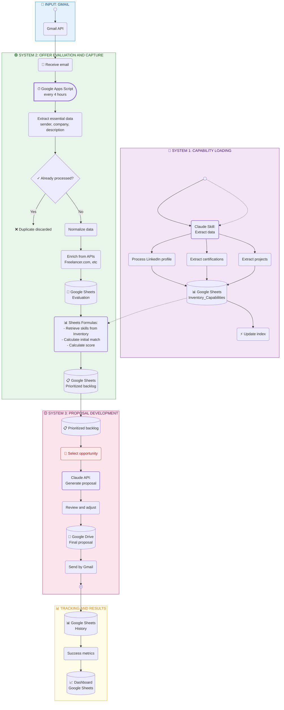

# Process and Steps View - Leads Auto

Detailed diagram of system processes, activities, decisions, and steps.



## Detailed Process Description

### 📧 Input: Gmail
**Trigger:** New email in specific inbox

---

### 🔵 System 1: Capability Loading
**Type:** Event-driven (only when changes occur)
**Frequency:** Manual/automatic on changes
**Responsibility:** Maintain updated inventory of skills and competencies

| Step | Tool | Description |
|------|------|------------|
| 1.0 | 🔄 Event | Change detected in LinkedIn/Projects/Certifications |
| 1.1 | 🟣 Claude Skill | Read data from source (LinkedIn, Drive with projects) |
| 1.2 | 🟣 Claude Skill | Extract and structure LinkedIn profile |
| 1.3 | 🟣 Claude Skill | Extract certifications and validations |
| 1.4 | 🟣 Claude Skill | Extract projects and success cases |
| 1.5 | 💾 Google Sheets | Save assets, skills, and competencies in **Inventory_Capabilities** |
| 1.6 | ⚡ Automatic | Update indexes and cross-references |

**Output:** Google Sheets `Inventory_Capabilities` with schema:
```
Skill | Level | Projects | Certifications | LinkedIn URL | Last updated
```

---

### 🟢 System 2: Offer Evaluation and Capture
**Type:** Automatic
**Frequency:** Every 4 hours (via Google Apps Script Cron)
**Responsibility:** Process, enrich, and evaluate offers for prioritization

#### 2.1 - Processing in Google Apps Script (Drive)
Google Apps Script executes **all processing in an integrated and complete manner** before saving to Google Sheets. It runs automatically every 4 hours. No intermediate data reaches [...]

| Step | Tool | Description |
|------|------|------------|
| 2.1 | 📧 Gmail | Receive new email with opportunity |
| 2.2 | 📝 Google Apps Script | Execute complete processing script (cron every 4h) |
| 2.3 | ⚡ Automatic | Extract: sender, company, description, URL |
| 2.4 | ✓ Validation | Check Google Sheets: Hash already processed? |
| 2.4a | ❌ If duplicate | Mark as duplicate, don't process |
| 2.4b | ✅ If new | Continue to step 2.5 |
| 2.5 | ⚡ Automatic | Normalize extracted data |
| 2.6 | 🌐 External API | Enrich from Freelancer.com API (only not processed before) |
| 2.6a | ⚡ Automatic | Get additional data: budget, required skills, complexity, etc |

**Enriched data obtained:**
```
Date | Sender | Company | Description | URL | Hash | Status
+ Budget | Required Skills | Complexity | Platform
```

**Script writes to columns A-L only:**
- Platform | Title | Domain/Sector | Tools/Skills | Rate | Language | Location | Business Sector | + 4 more enriched fields
- **No relevance criteria applied at this stage** — pure data extraction and storage

#### 2.2 - Evaluation and Prioritization (Google Sheets)
Evaluation and prioritization is performed **completely in the "Evaluation" spreadsheet** using Google Sheets formulas that automatically query the `Inventory_Capabilities`.

The validation happens in **two distinct formula-driven steps**:

##### Step A: Veto Check (Column N)
Formulas read live from **Reglas_Freelance** sheet and apply hard filters:
- **Language** ← Must match rules
- **Location** ← Must match rules
- **Business Sector** ← Must match rules
- **Minimum Rate** ← Must meet threshold

**Result:** If ANY filter triggers → Status = **DESCARTADO-VETO**, Score = 0

##### Step B: Capability Match (Column O-P)
If no veto, formulas attempt to match the lead against **Inventory_Capacidades** (14 rows):
- Search for **Elemento_Clave** (key words) in lead's Title + Domain + Tools
- Look for reasonable keyword overlap with available skills
- If NO match found or Fit is too low → Status = **DESCARTADO-LOW-MATCH**, Score stays below threshold

**Result:** Only leads with both veto clearance AND reasonable skill match advance to the backlog

| Step | Tool | Description |
|------|------|------------|
| 2.7 | 💾 Google Sheets | Save completely processed and enriched data in "Evaluation" sheet (A-L) |
| 2.8 | 📊 Formulas (Col N) | **Veto validation:** Check Language, Location, Sector, Rate against Reglas_Freelance |
| 2.9 | 📊 Formulas (Col O) | **Capability Fit:** Match Title/Domain/Tools against Inventory_Capacidades keywords |
| 2.10 | 📊 Formulas (Col P) | Calculate Score (0-100) based on match % and prioritization factors |
| 2.11 | 📋 Google Sheets | Save to "Prioritized backlog" (sorted by score, updated automatically) |

**Schema in Google Sheets "Evaluation":**
```
Offer | Budget | Required Skills | Available Skills | Match % | Score | Priority | Status | Assigned
├─ Status values:
│  ├─ DESCARTADO-VETO → Failed veto filters (language, location, sector, rate)
│  ├─ DESCARTADO-LOW-MATCH → Passed veto but no skill match found
│  ├─ PENDIENTE → Awaiting review
│  └─ SELECCIONADO → Ready for proposal
```

---

### 🟡 System 3: Proposal Development
**Type:** Semi-automatic (requires manual review)
**Frequency:** As available
**Responsibility:** Generate personalized proposals

| Step | Tool | Description |
|------|------|------------|
| 3.1 | 📋 Google Sheets | Get next opportunity from prioritized backlog |
| 3.2 | 👤 Manual | Review opportunity and decide whether to proceed |
| 3.3 | 🟣 Claude API | Generate personalized proposal with context |
| 3.4 | 👤 Manual | Review, adjust, validate proposal |
| 3.5 | 📄 Google Drive | Save proposal (PDF or Docs) |
| 3.6 | 📧 Gmail | Send by email to client |
| 3.7 | 📋 Google Sheets | Register sending (date, result) |

**Input to Claude API:**
```json
{
  "offer": { "company", "description", "budget", "required skills" },
  "competencies": { "available skills", "level", "similar projects", "certifications" },
  "template": "standard_proposal_v1"
}
```

---

### 📊 Tracking and Results
| Step | Tool | Description |
|------|------|------------|
| M.1 | 📋 Google Sheets | Record proposal result (accepted/rejected) |
| M.2 | ⚡ Formulas | Calculate: conversion rate, average time, revenue |
| M.3 | 📈 Dashboard | Display KPIs in Google Sheets |

---

## Tool Legend

| Symbol | Tool | Use |
|--------|------|-----|
| 📧 | Gmail API | Opportunity input |
| 📝 | Google Apps Script | Complete automatic processing (extract, validate, enrich) - Cron every 4h |
| 🟣 | Claude (Pro/API) | Intelligent processing |
| 💾 | Google Sheets | Main storage and evaluation (only final data + formulas) |
| 📄 | Google Drive | Documents and proposals |
| 🌐 | External APIs | Data enrichment |
| ⚡ | Sheets Formulas | Calculations, matching, and automation |
| 👤 | Manual | Human intervention |

---

## Responsibility Matrix

```
System 1 (Capability Loading)
├── Trigger: Changes in LinkedIn/Projects
├── Responsible: Claude Skill
├── Data: Google Sheets (Inventory_Capabilities)
└── Frequency: Event-driven (manual + monitoring)

System 2 (Offer Evaluation and Capture)
├── Trigger: New email
├── Processing Stage 1: Google Apps Script (cron every 4 hours)
│   ├── Role: Extract and write raw data (columns A-L)
│   ├── Columns: Platform, Title, Domain, Tools, Rate, Language, Location, Sector, + enrichment
│   ├── No criteria applied: pure data collection
│   └── Hash check: Detect and skip duplicates
│
├── Processing Stage 2: Google Sheets Formulas (Evaluation sheet)
│   ├── Veto Filter (Column N): Language, Location, Sector, Rate vs Reglas_Freelance
│   │   └── Result: DESCARTADO-VETO or PASS
│   ├── Capability Match (Column O): Title/Domain/Tools vs Inventory_Capacidades keywords
│   │   └── Result: DESCARTADO-LOW-MATCH or PASS
│   ├── Scoring (Column P): Calculate 0-100 score if both stages pass
│   │   └── Result: Score value or below-threshold
│   └── Output: "Prioritized backlog" (auto-sorted by score)
│
├── Data flow: 
│   └── "Evaluation" sheet: Processed data (A-L) + Veto/Match/Score formulas (N-P)
│   └── "Prioritized backlog": Automatically sorted view (high score first)
│
└── Frequency: Every 4 hours (automatic)

System 3 (Proposal Development)
├── Trigger: Manual backlog review
├── Responsible: Claude API + Human manual
├── Data: Google Sheets (Status) + Google Drive (Proposals)
└── Frequency: On demand
```

---

## Implementation: Key Technologies

### Google Workspace
- **Gmail API**: Read emails and send proposals
- **Sheets API**: CRUD on tables (offers, backlog, inventory) - only final data
- **Drive API**: Save generated proposals
- **Apps Script**: Automatic integrated processing with Cron (extraction every 4h, validation, enrichment from APIs)

### Formulas and Automation in Google Sheets
- **VLOOKUP / INDEX-MATCH**: Retrieve skills from Inventory_Capabilities
- **Veto Filters**: Hard rules from Reglas_Freelance (language, location, sector, rate)
- **Keyword Matching**: Search Elemento_Clave from Inventory_Capacidades in lead fields
- **Scoring**: Algorithm for prioritization based on match % and additional factors
- **Automatic Sorting**: Prioritized backlog updates automatically

### Claude
- **Claude Skill**: Point-in-time capability loading (event-driven)
- **Claude API**: Real-time proposal generation

### External Data
- **Freelancer.com API**: Enrich offers within Google Apps Script
- **LinkedIn**: Profile and certifications (manual/automated reading)
- **Google Drive**: Store projects and success cases
