# Workflow - Leads Auto (DRAFT)

BPMN diagram of the leads processing automation flow.

```mermaid
---
config:
  layout: elk
---
flowchart LR
    subgraph Pool["Freelance Operations — Product Owner"]
        direction LR

        subgraph LaneFuentes["External sources"]
            direction TB
            Odoo["Odoo<br/>Contracts and catalog"]
            Drive["Google Drive<br/>Documents"]
            Notion["Notion<br/>Runbooks"]
            GitHub["GitHub<br/>Repos"]
            YouTube["YouTube<br/>Demo videos"]
            LinkedInDoc[("LinkedIn + Projects<br/>and Certifications")]
            Correo@{ shape: sm-circ, label: "✉ New email" }
        end

        subgraph LaneCapacidades["System 1<br/>Capability Evaluation"]
            direction TB
            Sync@{ shape: delay, label: "⏱ Synchronize assets" }
            ClasifIA("⚡ AI Classification")
            Activos[("Available assets")]
            Reglas[("Work rules")]
            Config("⚡ Parameter configuration")
            Inventario("⚡ Capability inventory")
            Skill@{ shape: trap-t, label: "👤 Skill leads-freelance" }

            Sync -.-> ClasifIA
            ClasifIA -.-> Activos
            Reglas --> Config
            Activos --> Inventario
            LinkedInDoc --> Inventario
            Reglas --> Skill
            Inventario --> Skill
        end

        subgraph LaneOfertas["System 2<br/>Offer Evaluation"]
            direction TB
            Captura@{ shape: delay, label: "⏱ Capture opportunity" }
            Evaluacion("⚡ Evaluate and prioritize offer")
            Match@{ shape: diamond, label: "✓ High match?" }
            Backlog[("Prioritized backlog")]

            Correo --> Captura
            Captura --> Evaluacion
            Config --> Evaluacion
            Inventario --> Evaluacion
            Evaluacion --> Match
            Match -->|Yes| Backlog
            Match -.->|No| Descartada@{ shape: text, label: "Opportunity discarded" }
        end

        subgraph LanePropuestas["System 3<br/>Proposal Development"]
            direction TB
            Propuesta("⚡ Design value proposal")
            Aprobacion@{ shape: diamond, label: "✓ Validation / approval" }
            Puja("⚡ Send proposal")
            Resultado@{ shape: framed-circle, label: "Result" }

            Backlog ==> Propuesta
            Propuesta -.-> Aprobacion
            Aprobacion -->|Approved| Puja
            Aprobacion -.->|Review| Propuesta
            Puja --> Resultado
        end

        Odoo -.-> Sync
        Drive -.-> Sync
        Notion -.-> Sync
        GitHub -.-> Sync
        YouTube -.-> Sync
    end

    subgraph Leyenda["Legend"]
        direction TB

        subgraph FilaEventos["Events and triggers (BPMN)"]
            direction LR
            LEvento@{ shape: sm-circ, label: "✉ Event" }
            LProgramado@{ shape: delay, label: "⏱ Scheduled" }
            LManual@{ shape: trap-t, label: "👤 Manual task" }
        end

        subgraph FilaActividades["Activities and decisions (BPMN)"]
            direction LR
            LAutomatizado("⚡ Automated task")
            LDecision@{ shape: diamond, label: "✓ Gateway / decision" }
            LDatos[("Data / repository")]
            LResultado@{ shape: framed-circle, label: "Result" }
        end

        subgraph FilaEstado["Implementation status"]
            direction LR
            LActivo["Active today"]
            LCurso["In progress — mechanism ready, data/tests pending"]
            LPendiente["Pending — not built"]
        end
    end

    Pool ~~~ Leyenda

    classDef fuente fill:#eef2ff,stroke:#818cf8,color:#1e1b4b
    classDef capacidades fill:#ecfeff,stroke:#22d3ee,color:#164e63
    classDef ofertas fill:#f0fdf4,stroke:#4ade80,color:#14532d
    classDef propuestas fill:#fff7ed,stroke:#fb923c,color:#7c2d12
    classDef datos fill:#fefce8,stroke:#facc15,color:#713f12
    classDef resultado fill:#fdf4ff,stroke:#e879f9,color:#701a75
    classDef leyenda fill:#ffffff,stroke:#64748b,color:#1e293b

    class Odoo,Drive,Notion,GitHub,YouTube,Correo fuente
    class LinkedInDoc fuente
    class Sync,ClasifIA,Activos,Reglas,Config,Inventario,Skill capacidades
    class Captura,Evaluacion,Match,Descartada,Backlog ofertas
    class Propuesta,Aprobacion,Puja propuestas
    class LDatos datos
    class Resultado,LResultado resultado
    class LEvento,LProgramado,LManual,LAutomatizado,LDecision,LActivo,LCurso,LPendiente leyenda

    style Pool fill:#ffffff,stroke:#334155,color:#0f172a,stroke-width:2px
    style LaneFuentes fill:#eef2ff,stroke:#818cf8,color:#1e1b4b
    style LaneCapacidades fill:#ecfeff,stroke:#22d3ee,color:#164e63
    style LaneOfertas fill:#f0fdf4,stroke:#4ade80,color:#14532d
    style LanePropuestas fill:#fff7ed,stroke:#fb923c,color:#7c2d12
    style Leyenda fill:#ffffff,stroke:#64748b,color:#1e293b
    style FilaEventos fill:#ffffff,stroke:#94a3b8,color:#1e293b
    style FilaActividades fill:#ffffff,stroke:#94a3b8,color:#1e293b
    style FilaEstado fill:#ffffff,stroke:#94a3b8,color:#1e293b

    %% --- Implementation status: border thickness/stroke, background color continues marking the system (lane) ---
    %% Active today: solid and thick border
    style Correo stroke-width:3px
    style Captura stroke-width:3px
    style Evaluacion stroke-width:3px
    style Match stroke-width:3px
    style Backlog stroke-width:3px
    style Descartada stroke-width:3px
    style Reglas stroke-width:3px
    style Config stroke-width:3px
    style Skill stroke-width:3px
    style LinkedInDoc stroke-width:3px
    style LActivo stroke-width:3px

    %% In progress: automated mechanism, incomplete data/tests — medium dashed border
    style Activos stroke-dasharray:6 3
    style Inventario stroke-dasharray:6 3
    style LCurso stroke-dasharray:6 3

    %% Pending: not built — thin dashed border + lower opacity
    style Odoo stroke-dasharray:2 3,opacity:0.6
    style Drive stroke-dasharray:2 3,opacity:0.6
    style Notion stroke-dasharray:2 3,opacity:0.6
    style GitHub stroke-dasharray:2 3,opacity:0.6
    style YouTube stroke-dasharray:2 3,opacity:0.6
    style Sync stroke-dasharray:2 3,opacity:0.6
    style ClasifIA stroke-dasharray:2 3,opacity:0.6
    style Propuesta stroke-dasharray:2 3,opacity:0.6
    style Aprobacion stroke-dasharray:2 3,opacity:0.6
    style Puja stroke-dasharray:2 3,opacity:0.6
    style Resultado stroke-dasharray:2 3,opacity:0.6
    style LPendiente stroke-dasharray:2 3,opacity:0.6
```

## Systems Summary

### 🔵 System 1 - Capability Evaluation
Synchronizes assets from multiple external sources and builds a dynamic inventory of capabilities.

**Status:** 
- ✅ Active: Rules, Configuration, Skills
- 🟡 In progress: Assets, Inventory
- ⏳ Pending: Synchronization, AI Classification

### 🟢 System 2 - Offer Evaluation
Captures opportunities by email and evaluates them against the capabilities inventory for prioritization.

**Status:**
- ✅ Active: Capture, Evaluation, Decision, Backlog, Discard
- 🟡 In progress: (None)
- ⏳ Pending: (None)

### 🟠 System 3 - Proposal Development
Designs personalized value proposals and sends them after validation.

**Status:**
- ✅ Active: (None)
- 🟡 In progress: (None)
- ⏳ Pending: Proposal, Validation, Sending, Result

## Visual Encoding

| Status | Style | Meaning |
|--------|-------|---------|
| **Active today** | Solid thick border | Mechanism implemented and working |
| **In progress** | Medium dashed border | Mechanism ready, data/tests pending |
| **Pending** | Thin dashed border + opacity | Not built yet |

