# Flujo de Operaciones - Leads Auto

Diagrama BPMN del flujo de automatización de procesamiento de leads.

```mermaid
---
config:
  layout: elk
---
flowchart LR
    subgraph Pool["Freelance Operations — Product Owner"]
        direction LR

        subgraph LaneFuentes["Fuentes externas"]
            direction TB
            Odoo["Odoo<br/>Contratos y catálogo"]
            Drive["Google Drive<br/>Documentos"]
            Notion["Notion<br/>Runbooks"]
            GitHub["GitHub<br/>Repos"]
            YouTube["YouTube<br/>Videos demo"]
            LinkedInDoc[("LinkedIn + Proyectos<br/>y Certificaciones")]
            Correo@{ shape: sm-circ, label: "✉ Nuevo correo" }
        end

        subgraph LaneCapacidades["Sistema 1<br/>Evaluación de capacidades"]
            direction TB
            Sync@{ shape: delay, label: "⏱ Sincronizar activos" }
            ClasifIA("⚡ Clasificación IA")
            Activos[("Activos disponibles")]
            Reglas[("Reglas de trabajo")]
            Config("⚡ Configuración de parámetros")
            Inventario("⚡ Inventario de capacidades")
            Skill@{ shape: trap-t, label: "👤 Skill leads-freelance" }

            Sync -.-> ClasifIA
            ClasifIA -.-> Activos
            Reglas --> Config
            Activos --> Inventario
            LinkedInDoc --> Inventario
            Reglas --> Skill
            Inventario --> Skill
        end

        subgraph LaneOfertas["Sistema 2<br/>Evaluación de ofertas"]
            direction TB
            Captura@{ shape: delay, label: "⏱ Capturar oportunidad" }
            Evaluacion("⚡ Evaluar y priorizar oferta")
            Match@{ shape: diamond, label: "✓ ¿Alto match?" }
            Backlog[("Backlog priorizado")]

            Correo --> Captura
            Captura --> Evaluacion
            Config --> Evaluacion
            Inventario --> Evaluacion
            Evaluacion --> Match
            Match -->|Sí| Backlog
            Match -.->|No| Descartada@{ shape: text, label: "Oportunidad descartada" }
        end

        subgraph LanePropuestas["Sistema 3<br/>Elaboración de propuestas"]
            direction TB
            Propuesta("⚡ Diseñar propuesta de valor")
            Aprobacion@{ shape: diamond, label: "✓ Validación / aprobación" }
            Puja("⚡ Enviar propuesta")
            Resultado@{ shape: framed-circle, label: "Resultado" }

            Backlog ==> Propuesta
            Propuesta -.-> Aprobacion
            Aprobacion -->|Aprobada| Puja
            Aprobacion -.->|Revisar| Propuesta
            Puja --> Resultado
        end

        Odoo -.-> Sync
        Drive -.-> Sync
        Notion -.-> Sync
        GitHub -.-> Sync
        YouTube -.-> Sync
    end

    subgraph Leyenda["Leyenda"]
        direction TB

        subgraph FilaEventos["Eventos y triggers (BPMN)"]
            direction LR
            LEvento@{ shape: sm-circ, label: "✉ Evento" }
            LProgramado@{ shape: delay, label: "⏱ Programado" }
            LManual@{ shape: trap-t, label: "👤 Tarea manual" }
        end

        subgraph FilaActividades["Actividades y decisiones (BPMN)"]
            direction LR
            LAutomatizado("⚡ Tarea automatizada")
            LDecision@{ shape: diamond, label: "✓ Gateway / decisión" }
            LDatos[("Datos / repositorio")]
            LResultado@{ shape: framed-circle, label: "Resultado" }
        end

        subgraph FilaEstado["Estado de implementación"]
            direction LR
            LActivo["Activo hoy"]
            LCurso["En curso — mecanismo listo, datos/pruebas pendientes"]
            LPendiente["Pendiente — no construido"]
        end
    end

    Pool ~~~ Leyenda

    classDef fuente fill:#eef2ff,stroke:#818cf8,color:#1e1b4b
    classDef capacidades fill:#ecfeff,stroke:#22d3ee,color:#164e63
    classDef ofertas fill:#f0fdf4,stroke:#4ade80,color:#14532d
    classDef propuestas fill:#fff7ed,stroke:#fb923c,color:#7c2d12
    classDef datos fill:#fefce8,stroke:#facc15,color:#713f12
    classDef resultado fill:#fdf4ff,stroke:#e879f9,color:#701a75
    classDef leyenda fill:#ffffff,stroke:#64748b,color:#1e293b

    class Odoo,Drive,Notion,GitHub,YouTube,Correo fuente
    class LinkedInDoc fuente
    class Sync,ClasifIA,Activos,Reglas,Config,Inventario,Skill capacidades
    class Captura,Evaluacion,Match,Descartada,Backlog ofertas
    class Propuesta,Aprobacion,Puja propuestas
    class LDatos datos
    class Resultado,LResultado resultado
    class LEvento,LProgramado,LManual,LAutomatizado,LDecision,LActivo,LCurso,LPendiente leyenda

    style Pool fill:#ffffff,stroke:#334155,color:#0f172a,stroke-width:2px
    style LaneFuentes fill:#eef2ff,stroke:#818cf8,color:#1e1b4b
    style LaneCapacidades fill:#ecfeff,stroke:#22d3ee,color:#164e63
    style LaneOfertas fill:#f0fdf4,stroke:#4ade80,color:#14532d
    style LanePropuestas fill:#fff7ed,stroke:#fb923c,color:#7c2d12
    style Leyenda fill:#ffffff,stroke:#64748b,color:#1e293b
    style FilaEventos fill:#ffffff,stroke:#94a3b8,color:#1e293b
    style FilaActividades fill:#ffffff,stroke:#94a3b8,color:#1e293b
    style FilaEstado fill:#ffffff,stroke:#94a3b8,color:#1e293b

    %% --- Estado de implementación: grosor/trazo de borde, el color de fondo sigue marcando el sistema (lane) ---
    %% Activo hoy: borde sólido y grueso
    style Correo stroke-width:3px
    style Captura stroke-width:3px
    style Evaluacion stroke-width:3px
    style Match stroke-width:3px
    style Backlog stroke-width:3px
    style Descartada stroke-width:3px
    style Reglas stroke-width:3px
    style Config stroke-width:3px
    style Skill stroke-width:3px
    style LinkedInDoc stroke-width:3px
    style LActivo stroke-width:3px

    %% En curso: mecanismo automatizado, datos/pruebas incompletos — borde medio punteado
    style Activos stroke-dasharray:6 3
    style Inventario stroke-dasharray:6 3
    style LCurso stroke-dasharray:6 3

    %% Pendiente: no construido — borde fino punteado + menor opacidad
    style Odoo stroke-dasharray:2 3,opacity:0.6
    style Drive stroke-dasharray:2 3,opacity:0.6
    style Notion stroke-dasharray:2 3,opacity:0.6
    style GitHub stroke-dasharray:2 3,opacity:0.6
    style YouTube stroke-dasharray:2 3,opacity:0.6
    style Sync stroke-dasharray:2 3,opacity:0.6
    style ClasifIA stroke-dasharray:2 3,opacity:0.6
    style Propuesta stroke-dasharray:2 3,opacity:0.6
    style Aprobacion stroke-dasharray:2 3,opacity:0.6
    style Puja stroke-dasharray:2 3,opacity:0.6
    style Resultado stroke-dasharray:2 3,opacity:0.6
    style LPendiente stroke-dasharray:2 3,opacity:0.6
```

## Resumen de Sistemas

### 🔵 Sistema 1 - Evaluación de Capacidades
Sincroniza activos desde múltiples fuentes externas y construye un inventario dinámico de capacidades.

**Estado:** 
- ✅ Activo: Reglas, Configuración, Skills
- 🟡 En curso: Activos, Inventario
- ⏳ Pendiente: Sincronización, Clasificación IA

### 🟢 Sistema 2 - Evaluación de Ofertas
Captura oportunidades por correo y las evalúa contra el inventario de capacidades para priorización.

**Estado:**
- ✅ Activo: Captura, Evaluación, Decisión, Backlog, Descarte
- 🟡 En curso: (Ninguno)
- ⏳ Pendiente: (Ninguno)

### 🟠 Sistema 3 - Elaboración de Propuestas
Diseña propuestas de valor personalizadas y las envía después de validación.

**Estado:**
- ✅ Activo: (Ninguno)
- 🟡 En curso: (Ninguno)
- ⏳ Pendiente: Propuesta, Validación, Envío, Resultado

## Codificación Visual

| Estado | Estilo | Significado |
|--------|--------|------------|
| **Activo hoy** | Borde sólido grueso | Mecanismo implementado y funcionando |
| **En curso** | Borde punteado medio | Mecanismo listo, datos/pruebas pendientes |
| **Pendiente** | Borde punteado fino + opacidad | No construido aún |
